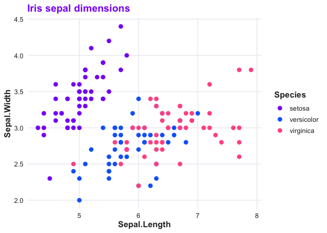

# spellbind

spellbind is the RLadies+ brand toolkit for R. It gives you colour
palettes, a ggplot2 theme, colour/fill scales, and branded R Markdown
templates so that everything your chapter produces looks like it belongs
together.

## Installation

Install from the [RLadies r-universe](https://rladies.r-universe.dev/):

``` r
install.packages("spellbind", repos = "https://rladies.r-universe.dev")
```

Or the development version from GitHub:

``` r
# install.packages("pak")
pak::pak("rladies/spellbind")
```

## Colours

The brand palette has three primary colours — purple, blue, and rose —
plus neutrals and tints for each.

``` r
library(spellbind)
rladies_cols("purple", "blue", "rose")
#>    purple      blue      rose 
#> "#881ef9" "#146af9" "#ff5b92"
```

## ggplot2 theme and scales

[`theme_rladies()`](https://rladies.org/spellbind/reference/theme_rladies.md)
pairs with
[`scale_colour_rladies()`](https://rladies.org/spellbind/reference/scale_rladies.md)
and
[`scale_fill_rladies()`](https://rladies.org/spellbind/reference/scale_rladies.md)
to give plots a consistent branded look.

``` r
library(ggplot2)

ggplot(iris, aes(Sepal.Length, Sepal.Width, colour = Species)) +
  geom_point(size = 2.5) +
  scale_colour_rladies() +
  theme_rladies() +
  labs(title = "Iris sepal dimensions")
```



Eight palettes are available — `"main"`, `"full"`, `"purple"`, `"blue"`,
`"rose"`, `"neutral"`, `"diverging"`, and `"light"`. See
[`?rladies_pal`](https://rladies.org/spellbind/reference/rladies_pal.md)
for details.

## R Markdown templates

Three branded templates ship with the package, available from RStudio’s
*File \> New File \> R Markdown \> From Template* menu:

- **RLadies+ HTML** —
  [`spellbind::rladies_html`](https://rladies.org/spellbind/reference/rladies_formats.md)
- **RLadies+ PDF** —
  [`spellbind::rladies_pdf`](https://rladies.org/spellbind/reference/rladies_formats.md)
- **RLadies+ Xaringan** — slide deck with brand CSS

## Getting started

``` r
vignette("spellbind")
```

Or browse the [pkgdown site](https://rladies.org/spellbind/).
